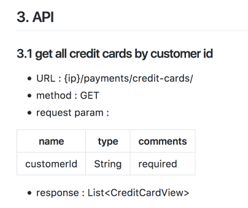

# Restful api test
## 1. Introduction
This repo is for RESTful api test

## 2. Technology stack

This test is powered by many powerful frameworks and third-party library:

+ [gradle](https://gradle.org/) 
+ [Spock Framework](http://spockframework.org/spock/docs/1.1-rc-3/index.html) 
+ [Groovy](https://groovy-lang.org)

Make sure you have installed these tools in your platform

## 3. Demonstration of project structure
Taking `category` service for example
``` java
└── src
	└── test
		├── groovy
		│   └── io
		│       └── reactivesw //Test for RESTful api
		│           ├── category //Test category service 
		│           │   ├── CreateCategoryTest.groovy         //Test create category api provided by category service
		│           │   ├── DeleteCategoryTest.groovy         //Test delete category api provided by category service
		│           │   ├── GetCategoryTest.groovy          //Test get category api provided by category service
		│           │   ├── HealthCheckTest.groovy          //Check health status of category service
		│           │   ├── UpdateCategoryTest.groovy         //Test update category api provided by category service
		│           │   └── config        //Configuration of category service test
		│           │       └── CategoryConfig.groovy
		│           ├── config          //Global configuration for the entire project
		│           │   └── GlobalConfig.groovy
		│           └── util        //A set of utility functions for RESTful api test
		│               ├── CategoryDataFactory.groovy         //Return data which is for the test of category service
		│               ├── CleanupMap.groovy         //A map to clean up mock data which has been pushed to server
		│               ├── CleanupUtil.groovy        //Utility function to clean up mock data
		│               ├── CustomerAuthenticationDataFactory.groovy       //Return data which is for the  test of customer-authentication service
		│               ├── PaymentDataFactory.groovy       //Return data which is for the test of payment service
		│               └── RestClientFactory.groovy        //Wrapper of httpbuilder, makes it easier to send http request
		└── resources      //Resource for RESTful api test (for example, a list of mock data)
			├── category       // Mock data for resting category service
			│   ├── Category.json
			│   ├── CategoryWithAllParams.json
			│   ├── InvalidCategoryUpdate.json
			│   ├── MultiUpdate.json
			│   ├── UpdateDescription.json
			│   ├── UpdateExternalId.json
			│   ├── UpdateMetaDescription.json
			│   ├── UpdateMetaKeywords.json
			│   ├── UpdateMetaTitle.json
			│   ├── UpdateName.json
			│   ├── UpdateOrderHint.json
			│   ├── UpdateParent.json
			│   └── UpdateSlug.json
```

## 4. How to write test


### 4.1. New Test
The structure of project has been demonstrated above. When you want to test a
service, firstly, you should add a new package which names after the service you
want to test in `reactivesw` directory. In the meanwhile, you should add a new
directory with the same name in `resources` directory which is for mock data.

### 4.2. About mock data
Suppose now you need to set up some mock data for your test, you should put your
mock data into `resources` directory as mention above. Otherwise, the mock data
should be json file named after the method you are going to test. Then, you have
your mock data now, you should add a `DataFactory` class to get your
data. Taking `payment` service test for example, you should add a
`PaymentDataFactory` class, and then get a json file with static method, such
as:

``` groovy
class PaymentDataFactory {
    static def slurper = new groovy.json.JsonSlurper()

    public static def getValidCreditCardView() {
        return slurper.parse(new FileReader('src/test/resources/payment/addCreditCard.json'));
    }
}
```

Thus, you could gain `addCreditCard.json` by calling `getValidCreditCardView`
method

### 4.3. Writing test with api documentation
You have mock data now, so you could start to write test dependent on api
documentation. Taking `payment` service for example as above, what you should do
first is to read
the
[api documentation of payment service](https://github.com/reactivesw/payment/blob/master/docs/api.md). After
glancing at api documentation, you should start to test the method defined in
api documentation. As for a regular method, you should write both "pass" and
"fail" util test. As the api doc shows below, 

for method which gets all credit cards by customer id, you should write at least
a test could get credit cards with customer id successfully, and another test
that will fail (for example, with invalid customer id). Otherwise, If a method
has several parameters, some parameters are optional, others are required, then,
you should test the different combination of parameters as much as possible

### 4.4. Setup() and cleanup()
When you have two or more tests that operate on the same or similar sets of
objects, for convenience, you could use fixture methods, such as `setup()`,
`cleanup()`, `setupSpec()`, `cleanupSpec()`. For example, if you want to prepare
some data for all feature methods, you could set it up in `setupSpec()`, or you
have pushed some mock data to server, you should clean up the mock data after
you finish testing, so you could put your cleanup method in `cleanupSpec()`. For
example:

``` groovy
       def setupSpec() {
        category = CategoryDataFactory.getCategory().validCategory1
        client = RestClientFactory.getJsonClient(CategoryConfig.rootURL)
        def response = client.post(body: category)
        id = response.data.id
        version = response.data.version
        cleanupMap.addObject(response.data.id, response.data.version)
    }
```

``` groovy
def cleanupSpec() {
        CleanupUtil.cleanup(CategoryConfig.rootURL, cleanupMap)
    }
```

You could put all mock data needed to clear in `cleanupMap`, and they will be
clear after calling `cleaupSpec()` method in the end. For more details, you
should
check
[Spock Framework Reference Documentation](http://spockframework.org/spock/docs/1.1-rc-3/index.html)

### 4.5. Guide about test
For code style and maintaining, there are seveal rules you should follow when you write test.

#### 4.5.1 Method name
By convention and convenience, feature methods are named with String literals
which should includes test number, description about what you are going to test,
parameters(optional), and expected result. For example:

``` groovy
    def "Test1: create category with name and slug, should return 200 ok and category view"() {
	//your test code
    }
```

so it is supur clear about this test, you could know exactly what this test want
to do without extra comments

#### 4.5.2 Blocks
There are several kinds of blocks in Spock framework: `given`, `when`, `then`.
For each block you use in test, you should explicitly express what kind of work
does this code block do and correspond to your method name. For example:

``` groovy
    def "Test1: create category with name and slug, should return 200 ok and category view"() {
        given: "prepare  data"
        def category = CategoryDataFactory.getCategory().validCategory1

        when: "call category api to create category"
        def response = client.post(body: category)

        then: "should return 200 ok and category view"
        response.status == 200
        response.data.name == category.name
        response.data.slug == category.slug
        cleanupMap.addObject(response.data.id, response.data.version)
    }
```

So, it is clear to demonstrate a test without any other extra comments

## 5. How to run test

Taking security into account, so you should avoid writing all sensitive
information into configuration file and should get it from environment
variable. In this case, if you want to run test, you have to set the environment
variable `TEST_SERVER` first. For Linux/Unix, you could run the below command in
terminal or put it in `.bashrc` or `.zshrc`

```shell
export TEST_SERVER="your test server ip"
```
and then run test:

```shell
gradle test
```
